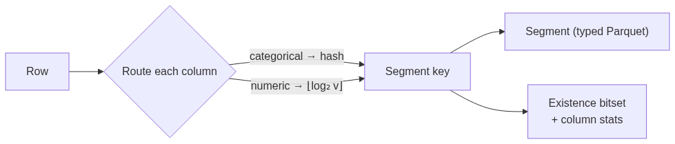

# STRATA

> A multi-column segment-pruning query engine in Rust. STRATA skips data that per-column statistics cannot, by recording which value combinations actually **co-occur** in each segment.

[](LICENSE)
[](https://github.com/batalabs/strata-query/actions/workflows/ci.yml)

> **Status:** research prototype. The techniques here back forthcoming papers (MARS, then STRATA). APIs and on-disk formats are not yet stable.

---

## Contents

- [The idea: existence ≠ co-existence](#the-idea-existence--co-existence)
- [How it works](#how-it-works)
- [The data model](#the-data-model)
- [MARS: magnitude-aware routing](#mars-magnitude-aware-routing)
- [Quick start](#quick-start)
- [Using the REST API](#using-the-rest-api)
- [Supported SQL](#supported-sql)
- [Benchmark: pruning at work](#benchmark-pruning-at-work)
- [Architecture](#architecture)
- [Development](#development)
- [License](#license)

---

## The idea: existence ≠ co-existence

Most data-skipping techniques (Parquet zone maps, min/max indexes, Bloom filters) evaluate each column **independently**. For a query like `WHERE category = 'A' AND value >= 100`, they ask "could this segment contain `A`?" and "could it contain a value ≥ 100?" *separately*. A segment that holds `A` rows **and** high-value rows passes both checks, even if no single row has **both**. That is a false positive, and it forces a read.

STRATA records, per segment, a compact **existence bitset**: which `(X, Y, Z)` bucket combinations *actually co-occur* in that segment. A query becomes one bitwise intersection against that bitset, so STRATA prunes a segment unless it provably contains a row matching **all** predicates at once.

| | Per-column stats (zone maps, Bloom) | STRATA existence bitset |
| --- | --- | --- |
| Single-column predicate | ✅ prunes | ✅ prunes |
| Multi-column conjunction | ❌ checks columns independently → false positives | ✅ checks co-occurrence → no false positives |
| Cost at query time | one check per column | one bitwise AND |
| Per-segment overhead | a few stats per column | one small bitset (tens to hundreds of bytes) |

- **Categorical columns** are routed by hash.
- **Numeric columns** are routed by **MARS** (Magnitude-Aware Routing, `bucket(v) = ⌊log₂ v⌋`), which preserves magnitude order so range queries skip whole buckets.

## How it works

**Write path:** every row is routed to a segment, and its bucket combination is recorded in that segment's existence bitset:



**Query path:** three levels of pruning, cheapest first:


1. **Segment pruning:** the existence bitset skips entire segments that cannot match the full predicate. *(This is STRATA's contribution.)*
2. **Row-group pruning:** within surviving segments, Parquet column statistics skip row groups.
3. **Row filtering:** remaining rows are checked against the predicate, so results are always exact.

## The data model

Data is partitioned into **segments** by routing up to three dimensions `(X, Y, Z)` into `R`, `S`, and `T` buckets respectively. Each segment carries:

- a **typed Parquet** file with the actual rows,
- an **existence bitset** of `R × S × T` bits, where bit `x·S·T + y·T + z` is set iff some row in the segment falls in bucket combination `(x, y, z)`,
- per-column **statistics** (count / sum / min / max).

A query resolves its predicate to the set of bucket combinations it could match, builds the same bitset layout as a **mask**, and keeps only segments whose bitset **intersects** the mask.

```text
Example: dims = (category[R=4], value[S=16, MARS], region[T=8])

Query:  WHERE category = 'A' AND value BETWEEN 100 AND 500
        category 'A'        → x = hash('A') mod 4
        value [100, 500]    → y ∈ {6, 7, 8}     (⌊log₂100⌋=6 … ⌊log₂500⌋=8)
        region (unconstrained)→ z ∈ {0 … 7}

Mask bits = { x·16·8 + y·8 + z : y ∈ {6,7,8}, z ∈ 0..7 }
A segment is read only if its bitset shares a set bit with this mask.
```

Because `value` is MARS-routed, the range `[100, 500]` collapses to **3 buckets** out of 16, and the rest are skipped before any I/O.

## MARS: magnitude-aware routing

For numeric columns, STRATA routes by `⌊log₂ v⌋`. Buckets grow geometrically, so a range query touches only a handful of them. This is **provably near-optimal**: for a range `[a, b]`, STRATA touches at most

```
⌈log₂(b / a)⌉ + 1   buckets
```

independent of the data size.

| Range `[a, b]` | Ratio `b/a` | Max buckets touched (`⌈log₂(b/a)⌉ + 1`) |
| --- | --- | --- |
| `[100, 200]` | 2 | 2 |
| `[50, 500]` | 10 | 5 |
| `[100, 1000]` | 10 | 5 |
| `[1, 1000]` | 1000 | 11 |

Hash routing, by contrast, destroys ordering: a numeric range would have to touch *every* bucket. MARS keeps magnitude structure intact, which is what makes range pruning possible.

## Quick start

### Build

```bash
cargo build --release
```

### Run a server

**REST API** (defaults to port 3131; override with `STRATA_PORT`):

```bash
cargo run --release --bin strata_server
# STRATA server listening on http://0.0.0.0:3131
```

**Arrow Flight SQL** (gRPC, port 41415). Point any Flight SQL-capable BI client at it:

```bash
cargo run --release --bin strata_flight_server
# 🚀 Strata Flight SQL server on grpc://0.0.0.0:41415
```

### Docker

```bash
docker build -t strata-query .
docker run -p 3131:3131 strata-query
```

## Using the REST API

The REST server exposes five endpoints:

| Method | Path | Purpose |
| --- | --- | --- |
| `POST` | `/load` | Create/append a table from CSV and build segments |
| `POST` | `/query` | Run a SQL query (returns rows **and** pruning stats) |
| `GET`  | `/tables` | List tables with segment/row counts |
| `GET`  | `/tables/{name}` | Info for one table |
| `GET`  | `/health` | Liveness + table count |

### Load data

`dimensions` lists up to three routing columns `(X, Y, Z)`. List any numeric columns in `numeric_dimensions` so they get **MARS** routing (required for range pruning); all others are hash-routed. `bucket_counts` is `[R, S, T]` (default `[16, 16, 24]`).

```bash
curl -X POST http://localhost:3131/load \
  -H "Content-Type: application/json" \
  -d '{
    "table": "events",
    "data": "category,value,region\nA,150.5,us\nB,25.0,eu\nA,500.0,us\nC,75.0,ap\nB,300.0,eu\nA,42.0,us",
    "dimensions": ["category", "value", "region"],
    "numeric_dimensions": ["value"],
    "bucket_counts": [4, 16, 8]
  }'
# {"table":"events","rows_loaded":6,"segments":6,"elapsed_ms":86}
```

### Query

```bash
curl -X POST http://localhost:3131/query \
  -H "Content-Type: application/json" \
  -d '{"sql": "SELECT * FROM events WHERE value >= 100 AND value <= 500"}'
```

```json
{
  "columns": ["category", "region", "value"],
  "rows": [["A", "us", "150.5"], ["A", "us", "500.0"], ["B", "eu", "300.0"]],
  "row_count": 3,
  "segments_scanned": 4,
  "segments_total": 6,
  "elapsed_ms": 1
}
```

Every `/query` response reports `segments_scanned` vs `segments_total`, so pruning is observable directly.

### Inspect tables

```bash
curl http://localhost:3131/tables
# {"tables":[{"name":"events","segments":6,"rows":6,"avg_rows_per_segment":1}]}

curl http://localhost:3131/health
# {"status":"ok","tables":1}
```

## Supported SQL

All of the following return **exact** results (segment pruning is followed by row-level filtering):

```sql
-- Exact match (hash routing)
SELECT * FROM events WHERE category = 'A';

-- IN list (hash routing)
SELECT * FROM events WHERE category IN ('A', 'B');

-- Numeric range (MARS routing; column must be in numeric_dimensions)
SELECT * FROM events WHERE value >= 100 AND value <= 500;

-- BETWEEN (MARS routing)
SELECT * FROM events WHERE value BETWEEN 50 AND 500;

-- Combined (hash + MARS)
SELECT * FROM events WHERE category = 'A' AND value >= 100;

-- Limit
SELECT * FROM events LIMIT 100;
```

## Benchmark: pruning at work

Pruning is not a hidden detail: every `/query` response reports how many segments it skipped, so you can measure it on your own data. The numbers below were produced by the steps in this README on a single machine: **40,000 rows** with `category ∈ {A,B,C,D}`, `value` log-uniform over ~`[1, 10⁶]`, `region ∈ {r0…r7}`, loaded with `numeric_dimensions: ["value"]` and `bucket_counts: [4, 20, 8]` → **40 segments**.

| Query | Rows returned | Segments scanned | Pruned | Time |
| --- | --- | --- | --- | --- |
| `SELECT * … LIMIT 5` (full scan) | 5 | 40 / 40 | 0% | 49 ms |
| `WHERE category = 'A'` | 10,098 | 20 / 40 | 50% | 36 ms |
| `WHERE value BETWEEN 32768 AND 65535` | 1,955 | 2 / 40 | **95%** | 5 ms |
| `WHERE value BETWEEN 100000 AND 130000` | 792 | 2 / 40 | **95%** | 2 ms |
| `WHERE category='A' AND value BETWEEN 32768 AND 65535` | 467 | 1 / 40 | **98%** | 2 ms |

The win is largest exactly where per-column statistics fail: a selective multi-column conjunction touches **one** segment out of forty. Times are in-memory on a laptop; the metric that matters is **segments skipped**, since that is what avoids I/O on large or cold (object-storage) datasets. Full empirical evaluation appears in the accompanying papers.

## Architecture


> Diagram sources (Mermaid) live in [`assets/diagrams/`](assets/diagrams/).

| Module | Responsibility |
| --- | --- |
| `routing/` | Segment routing: hash (categorical) and MARS `⌊log₂ v⌋` (numeric). |
| `storage/writer`, `storage/wal` | Segment writing, existence bitsets, column stats, crash recovery. |
| `storage/reader`, `storage/parquet_*` | Bitset pruning, predicate evaluation, typed Parquet I/O. |
| `query/` | SQL parsing into the internal query predicate. |
| `server`, `bin/` | REST and Arrow Flight SQL front ends. |
| `types` | Core types: `Row`, `SegmentMetadata`, `ExistenceBitset`, `TableSchema`. |

## Development

```bash
cargo test                                  # unit + integration tests
cargo clippy --all-targets -- -D warnings   # lint gate (matches CI)
cargo fmt --all -- --check                  # format gate (matches CI)
```

CI runs the same three gates on every push and pull request; the toolchain is pinned via `rust-toolchain.toml`.

## License

[MIT](LICENSE) © Rui Costa
